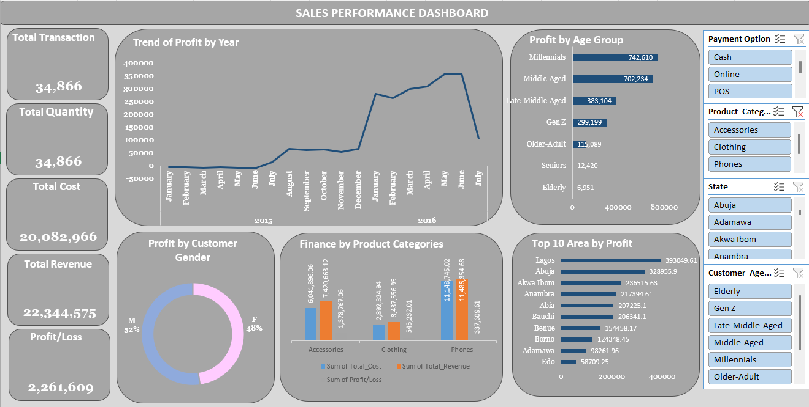

# 🛍️ Retail Sales Analysis Dashboard  
**Client-Simulated Project | 10Alytics Business Analyst Portfolio**

---

## 📌 Executive Summary

This project showcases my ability to extract business insights from transactional retail data using Microsoft Excel. As part of the 10Alytics Business Analysis track, I analysed multi-year sales data to identify revenue trends, customer segments, and product performance. The output includes a fully interactive Excel dashboard designed to support data-driven decision-making around marketing, inventory, and sales strategy.

---

## 👤 My Role

As the **Business Analyst**, I independently executed the end-to-end workflow — from cleaning and structuring raw sales data, through segmentation and KPI modelling, to building a compelling Excel dashboard and delivering executive-level insights and recommendations.

---

## 🔍 Context

This project was completed as part of the 10Alytics Business Analysis learning track. The aim was to demonstrate practical analytical skills by working with a large dataset of customer transactions.

The simulated data spanned multiple U.S. states and years, including demographic variables (age, gender, location) and transaction details (quantity, unit price, cost, profit margins).

---

## 💡 Tasks

### ✅ Data Cleaning & Preparation
- Cleaned and structured raw data for analysis
- Extracted age group, gender, payment method, and other key fields
- Converted date fields for monthly and yearly analysis

### 📊 Exploratory Data Analysis (EDA)
- Analysed revenue and profit trends from 2011–2016
- Segment-wise profit by **age group** and **gender**
- Identified high-performing **products**, **locations**, and **channels**

### 👥 Customer & Salesperson Profiling
- Grouped customers by age (Millennials, Adults, etc.)
- Analysed transaction volume by **payment mode** and **salesperson performance**

### 📈 Dashboard Design & Insight Delivery
Created a dynamic Excel dashboard visualising:
- Total Revenue, Cost, Profit
- MoM Profit Trends
- Product Category Performance
- Age Group Contribution to Profit
- Top 10 Profitable Locations
- Gender-based Transaction Analysis

---

## 📈 Key Outcomes

- **Gender Profit Margin**: Male customers contributed ~4% more profit than females
- **Millennials**: Dominated purchases, representing the top customer segment
- **Product Performance**: Accessories and Phones had the highest profitability and MoM growth
- **Sales Champions**: Segun and Kenny emerged as top-performing agents
- **Channel Efficiency**: Online sales were the dominant sales channel

---

## 📊 Dashboard Preview

---

## 🧰 Tools & Techniques

- **Microsoft Excel**
  - Pivot Tables & Pivot Charts  
  - Slicers & Timelines  
  - Data Cleaning (`TRIM`, `IF`, `VLOOKUP`, `SUMIFS`)  
  - Conditional Formatting  
  - KPI Modelling & Dynamic Visualisation

---

## 📎 Download the Dashboard

📥 [RetailSalesDashboard.xlsx](./RetailSalesDashboard.xlsx)

---

## 🧠 What I Learned

- Applying business analysis concepts to structured sales data
- Creating data stories from EDA and turning them into action
- Designing dashboards that communicate insights clearly and professionally

---

